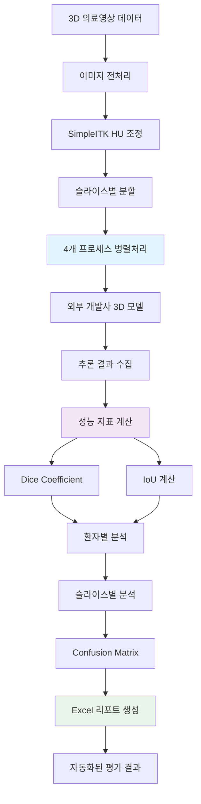

# 3D 의료영상 진단 모델 성능 평가 자동화 시스템

[](https://python.org)
[](https://pytorch.org)
[](https://simpleitk.org)
[](https://docs.python.org/3/library/multiprocessing.html)

> **닥터앤서 국가과제 지원을 위한 3D 의료영상 진단 모델 성능 평가 완전 자동화 시스템**

⚠️ 해당 프로젝트는 기관 요청에 따라 코드 전체가 비공개(private) 처리되어 있으며, 구현 세부 내용은 문서로만 제공됩니다.

## 주요성과

| 지표 | 달성값 | 설명 |
|------|--------|------|
| **평가 시간 단축** | 75% | 40분 → 10분으로 대폭 단축 |
| **처리 규모** | 300장 | 고해상도 3D 이미지 자동 평가 |
| **GPU 메모리 최적화** | OOM 완전 해소 | 병렬처리 + 메모리 관리로 안정성 확보 |
| **업무 효율성** | 4배 향상 | 연구원 수작업 부담 완전 해소 |

## 문제 해결

**문제**: 닥터앤서 국가과제에서 외부 개발사의 갑상선암 3D 진단 모델 성능 평가가 수작업으로 진행되어 40분 이상 소요되며, 12개 질병 × 2개 진단 서비스 개발 과정에서 심각한 병목 현상 발생

**해결**: 전체 평가 워크플로우를 완전 자동화하여 평가 시간을 75% 단축하고, 실시간 성능 피드백이 가능한 시스템 구축

### 핵심 해결 문제

**문제**: 300장 고해상도 3D 이미지 연속 처리 시 GPU 메모리 부족으로 시스템 중단 → **해결**: 4개 프로세스 병렬처리 + 캐시 삭제로 메모리 최적화

**문제**: 슬라이스별 수작업 평가로 인한 비효율성과 휴먼 에러 → **해결**: 전처리부터 리포트 생성까지 전체 파이프라인 자동화

**문제**: 단순 정확도만으로는 3D 의료영상 모델 성능 평가 한계 → **해결**: Dice Coefficient + IoU 이중 평가 및 환자별/슬라이스별 분석

## 시스템 아키텍쳐



### 핵심 컴포넌트

- **이미지 전처리 엔진**: SimpleITK 기반 HU 조정 및 슬라이스 분할
- **병렬처리 매니저**: 4개 프로세스로 GPU 메모리 최적화
- **성능 평가 모듈**: Dice Coefficient + IoU 이중 평가 시스템
- **리포트 생성기**: Excel 표 + Confusion Matrix 자동 시각화

## 기술적 문제 해결 예시

### 전략 1: GPU 메모리 최적화

```python
import multiprocessing as mp
from functools import partial
import torch
import gc

def process_patient_batch(patient_data, model, gpu_id):
    """환자별 배치 처리로 메모리 효율성 확보"""
    device = f'cuda:{gpu_id}'
    model.to(device)
    
    results = []
    for slice_data in patient_data:
        # 슬라이스별 추론
        with torch.no_grad():
            prediction = model(slice_data.to(device))
            results.append(prediction.cpu())
        
        # 즉시 GPU 메모리 정리
        del slice_data
        torch.cuda.empty_cache()
    
    # 환자별 처리 완료 후 캐시 정리
    gc.collect()
    return results

def parallel_evaluation(patient_list, model, num_processes=4):
    """4개 프로세스 병렬 처리"""
    with mp.Pool(processes=num_processes) as pool:
        process_func = partial(process_patient_batch, model=model)
        results = pool.map(process_func, patient_list)
    
    return results
```

### 전략 2: 포괄적 성능 평가

```python
import numpy as np
from sklearn.metrics import confusion_matrix
import pandas as pd

def comprehensive_evaluation(predictions, ground_truth):
    """Dice + IoU 이중 평가 시스템"""
    
    def dice_coefficient(pred, gt):
        intersection = np.sum(pred * gt)
        return (2. * intersection) / (np.sum(pred) + np.sum(gt))
    
    def iou_score(pred, gt):
        intersection = np.sum(pred * gt)
        union = np.sum(pred) + np.sum(gt) - intersection
        return intersection / union
    
    # 환자별 성능 계산
    patient_results = []
    for i, (pred, gt) in enumerate(zip(predictions, ground_truth)):
        dice = dice_coefficient(pred, gt)
        iou = iou_score(pred, gt)
        
        # 슬라이스별 세부 분석
        slice_metrics = []
        for slice_idx in range(pred.shape[0]):
            slice_dice = dice_coefficient(pred[slice_idx], gt[slice_idx])
            slice_iou = iou_score(pred[slice_idx], gt[slice_idx])
            slice_metrics.append({
                'slice': slice_idx,
                'dice': slice_dice,
                'iou': slice_iou
            })
        
        patient_results.append({
            'patient_id': i,
            'overall_dice': dice,
            'overall_iou': iou,
            'slice_details': slice_metrics
        })
    
    return patient_results

def generate_performance_report(results, output_path):
    """Excel 리포트 자동 생성"""
    # 환자별 성과 요약
    summary_df = pd.DataFrame([
        {
            'Patient_ID': r['patient_id'],
            'Dice_Score': r['overall_dice'],
            'IoU_Score': r['overall_iou']
        } for r in results
    ])
    
    # Confusion Matrix 생성
    all_predictions = np.concatenate([r['predictions'] for r in results])
    all_ground_truth = np.concatenate([r['ground_truth'] for r in results])
    cm = confusion_matrix(all_ground_truth.flatten(), all_predictions.flatten())
    
    # Excel 파일로 출력
    with pd.ExcelWriter(output_path) as writer:
        summary_df.to_excel(writer, sheet_name='Summary')
        pd.DataFrame(cm).to_excel(writer, sheet_name='Confusion_Matrix')
```

## 문제 해결

### 일반적 문제

- **GPU 메모리 부족 (OOM)** → 4개 프로세스 병렬처리 + 즉시 캐시 삭제로 안정성 확보  
- **수작업 평가의 휴먼 에러** → 전체 파이프라인 자동화로 일관성 있는 평가 환경 구축  
- **평가 지표의 한계** → Dice Coefficient + IoU 이중 평가로 포괄적 성능 측정  
- **개발사 피드백 지연** → 실시간 평가 결과 제공으로 개발 사이클 단축   

### 성능 최적화 방법

- **메모리 관리**: 슬라이스별 처리 후 즉시 GPU 캐시 정리로 메모리 효율성 확보
- **병렬처리 최적화**: CPU 코어 수 내에서 GPU 메모리 병목을 방지하는 최적 프로세스 수(4개) 설정
- **배치 처리**: 환자별 그루핑으로 I/O 오버헤드 최소화
- **에러 핸들링**: try/except 구조로 실패 케이스 자동 로깅 및 복구

---

*이 README는 닥터앤서 국가과제 수행 중 개발된 갑상선암 진단 모델 평가 자동화 시스템의 실제 구현 경험을 바탕으로 작성되었습니다.*
