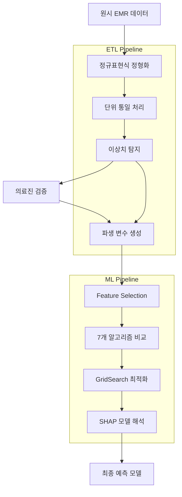

# EMR 기반 질환 예측 시스템

[](https://python.org)
[](https://scikit-learn.org)
[](https://xgboost.readthedocs.io)
[](https://shap.readthedocs.io)

> **국립암센터 기관 고유 과제 - 비정형 EMR 데이터 정형화 및 도메인 특화 예측 모델링**

## 프로젝트 개요

국립암센터에서 수행한 EMR(Electronic Medical Record) 기반 질환 예측 연구 프로젝트입니다.  
**비정형 의료 데이터를 체계적으로 정형화하여 기존 논문 대비 45% 성능 향상 달성**

### 핵심 성과 지표

| 지표 | 달성값 | 설명 |
|------|--------|------|
| **예측 성능** | ROC-AUC 0.87 | 기존 동일 주제 논문 대비 45% 향상 (0.61→0.87) |
| **데이터 정형화** | 3,000명 완료 | 비정형 EMR → 정형 데이터 100% 변환 |
| **모델 최적화** | class_weight 적용 | 3:7 클래스 불균형 문제 해결 |
| **자동화 효율성** | 80% 시간 단축 | ETL 파이프라인으로 반복 실험 자동화 |

## 시스템 아키텍처



## 주요 기술 스택

### 핵심 컴포넌트
- **데이터 정형화**: 정규표현식(re) + 사분위수 이상치 탐지
- **파생 변수**: BMI, CCI, 위험인자 조합 (의료진 협업)
- **최적 모델**: Logistic Regression + class_weight + GridSearch
- **모델 해석**: SHAP + Feature Importance 분석

## 기술적 구현 [예시]

### 1. 비정형 EMR 데이터 정형화

#### 정규표현식 기반 단위 통일
```python
import re
import pandas as pd
import numpy as np

class EMRDataProcessor:
    def __init__(self):
        self.unit_patterns = {
            'height': r'(\d+\.?\d*)\s*(cm|m)',
            'weight': r'(\d+\.?\d*)\s*(kg|g)',
            'volume': r'(\d+\.?\d*)\s*(ml|cc|L)'
        }
    
    def normalize_units(self, text, data_type):
        """수기 입력 데이터의 단위 통일"""
        pattern = self.unit_patterns.get(data_type)
        if not pattern:
            return None
            
        match = re.search(pattern, str(text))
        if match:
            value, unit = match.groups()
            value = float(value)
            
            # 최소 단위로 변환 (m→cm, L→ml 등)
            if data_type == 'height':
                return value if unit == 'cm' else value * 100
            elif data_type == 'weight':
                return value if unit == 'kg' else value / 1000
        return None
```

### 2. 의료 도메인 파생 변수 생성

#### 의료진 협업 기반 특성 엔지니어링
```python
class MedicalFeatureEngineer:
    def create_derived_features(self, df):
        """의학 논문 검토 + 의료진 협업 기반"""
        
        # BMI 계산
        df['BMI'] = df['weight'] / (df['height'] / 100) ** 2
        
        # CCI (Charlson Comorbidity Index)
        df['CCI'] = self.calculate_cci(df)
        
        # 복합 위험 인자
        df['high_risk_combination'] = (df['age'] > 65) & (df['CCI'] > 2)
        
        return df
    
    def calculate_cci(self, df):
        """표준 CCI 가중치 적용"""
        cci_weights = {
            'myocardial_infarction': 1,
            'diabetes': 1,
            'renal_disease': 2,
            'malignancy': 2
        }
        
        cci_score = 0
        for condition, weight in cci_weights.items():
            if condition in df.columns:
                cci_score += df[condition] * weight
        return cci_score
```

### 3. 모델 최적화 및 검증

#### GridSearch + 교차검증
```python
from sklearn.model_selection import GridSearchCV
from sklearn.linear_model import LogisticRegression

# 클래스 불균형 해결을 위한 class_weight 적용
param_grid = {
    'C': [0.01, 0.1, 1, 10, 100],
    'class_weight': ['balanced', {0: 1, 1: 2.33}],  # 3:7 비율 조정
    'solver': ['liblinear', 'lbfgs']
}

grid_search = GridSearchCV(
    LogisticRegression(random_state=42),
    param_grid,
    cv=5,  # 5-Fold 교차검증
    scoring='roc_auc',
    n_jobs=-1
)
```

### 4. 품질 검증 시스템

이상치 탐지 및 의료진 검증:
- 사분위수(Q1, Q3) 기반 이상치 탐지 (키 250cm, 체중 1130kg 등)
- 2달/1회 의료진 대면 미팅 + 일상 메일 컨택
- SQL 테이블 기준 + 의료진 직접 작성 표 이중 검증

## 기술적 도전과 해결

### 1. 비정형 데이터 품질 문제

**문제**: 수기 입력으로 인한 단위/표현 불일치, 논리적 오류
```python
# 발견된 이상치 예시
outliers = [
    "키: 250cm, 체중: 1130kg",
    "혈압: 300/200 mmHg", 
    "나이: 150세"
]
```

**해결**: 정규표현식 + 사분위수 + 의료진 검증
- 정규표현식으로 수치 추출 및 단위 통일
- IQR 방법으로 이상치 탐지 후 의료진 확인 요청
- 결측치 5% 기준 처리 방식 결정

### 2. 예측 변수 설계 최적화

**문제**: 기존 변수 간 약한 상관성으로 예측 성능 제한

**해결**: 의료진 협업을 통한 도메인 특화 파생 변수
- 의학 논문 검토 후 BMI, CCI 등 표준 지표 적용
- 복합 위험 인자 조합 (당뇨+흡연, 고령+동반질환 등)
- Feature Selection으로 통계적 유의성 검증

### 3. 클래스 불균형 문제

**문제**: 3:7 비율의 불균형 데이터

**해결**: class_weight 매개변수 최적화
- balanced 옵션과 수동 가중치 비교
- GridSearch로 최적 가중치 탐색
- Precision, Recall, F1-Score 균형 고려

## 성능 평가

### 평가 데이터셋
- 총 3,000명 환자 데이터
- Train:Val:Test = 8:1:1 분할
- 5-Fold 교차검증으로 과적합 방지

### 알고리즘 성능 

| 모델 | ROC-AUC | 특징 |
|------|---------|------|
| **Logistic Regression** | **0.87** | class_weight + 해석성 우수 |

## 핵심 인사이트

### 1. 데이터 품질의 중요성
- **발견**: EMR 정형화/정규화가 모델 성능의 핵심 결정 요인
- **개선 방향**: 체계적인 데이터 수집 및 검증 프로세스 구축

### 2. 도메인 지식의 가치
- **도전**: 범용 ML 기법의 의료 도메인 적용
- **접근**: 의료진 협업을 통한 파생 변수 설계가 45% 성능 향상의 핵심

### 3. 해석 가능성 확보
- **제약 조건**: 의료 분야 특성상 예측 근거 설명 필요
- **해결 전략**: SHAP + 통계 분석 조합으로 신뢰성 확보

## 비즈니스 임팩트

- **연구 성과**: 기존 동일 주제 논문 대비 45% 성능 향상으로 논문 2편 작성
- **방법론 기여**: EMR 데이터 정형화 및 파생 변수 설계 체계적 방법론 확립
- **기술적 가치**: 의료 AI 분야 도메인 전문성 및 품질 관리 역량 입증

---

*이 프로젝트는 국립암센터 기관 고유 과제로 수행되었으며, 의료 데이터 보안 정책에 따라 코드 및 상세 데이터는 공개되지 않습니다.*
